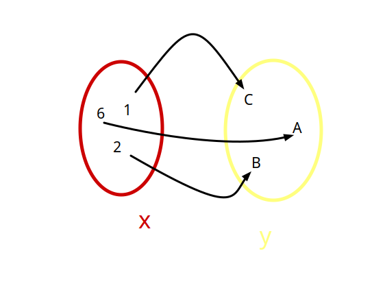
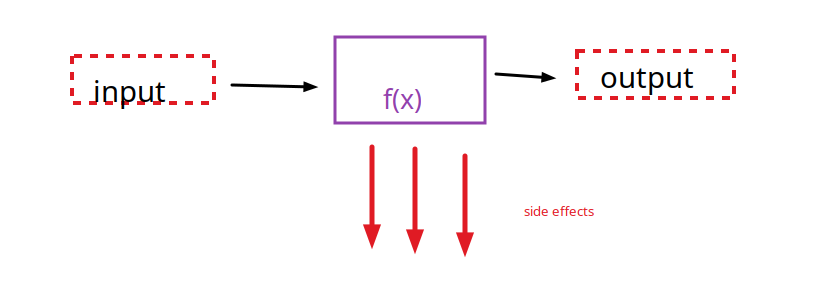

#   Paradigma funcional

---

> La programación funcional (PF) es un paradigma de programación al igual que la programación orientada a objetos (POO). La PF se basa en cálculo lambda y concretamente en composición de funciones puras para modelar las soluciones de software.'

---

## Historia 

-   1936 Alonzo chuch introduce el concepto de **Calculo Lambda**   
- 1960 se crea LISP
- 1978 se crea ML 
- 1990 Se estandariza un lenguaje funcional (Haskel)

---

## Caracteristicas principales

- Declarativo ( != Imperativo) enfocado en el **que** en lugar del como
    alto nivel,sin sentencias de control de flujo
- centrado en **funciones**
- Los programas se contruyen **componiendo y aplicando funciones**
- Basados en el concepto del **calculo Lambda**


---

## **7** Aspectos del paradigma funcional

- 1 - Programas como funciones 
- 2 - Funciones puras
- 3 - Datos inmutables 
- 4 - Funciones Primera clase
- 5 - Funciones de orden superior
- 6 - Composicion de funciones
- 7 - Recursividad (para iteracion)

### 1- Programas como funciones 

> El tipo principal son las **funciones**, escribimos funciones que interactuan entre si, llaman a otras, se componen se aplican etc


-  Un programa puramente funcional se compone mediante **aplicacion** y 
 **composicion** de funciones. 
- Un programa puede definirse como una lista de funciones. 
- Ejecutar un programa consiste en evaluar funciones siguiendo las bases establecidas por el calculo lambda.




### 2- Funciones puras

- X No usan datos fueras del ambito (scope) de la funcion
- No hay side effects (no pueden modificar un estado externo)
- Son deterministicas



``` scala
//side effect incrementa una variable fuera del ambito de la funcion, y utiliza datos fuera del scope
var total = 0;
def incrementar() = {
    total += 1;
}   

// funcion pura, no utiliza datos fuera del scope y no tiene side effects
var total = 0; 
def incrementar(x: Int) : Int = {
    return x+1;
}
```

### Beneficios de usar funciones puras <3

- Funciones cacheables
- Funciones paralelizables
- Faciles de testear
